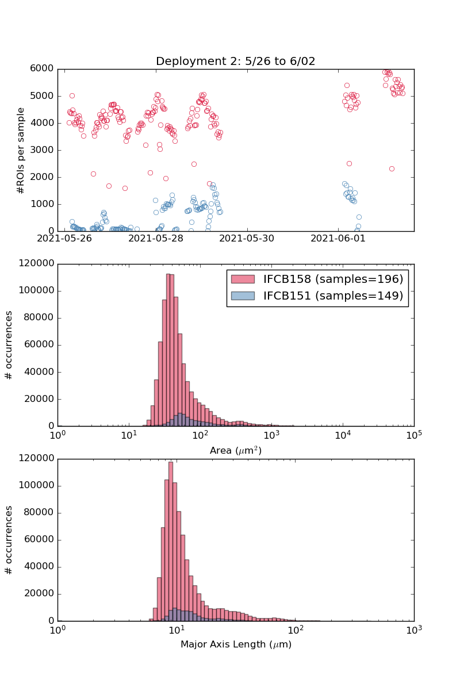

# Comparison of samples collected by the Imaging Flow Cytobot (IFCB)

`IFCB_samples_compare.py`

Compares two, side-by-side IFCB deployments: number of regions-of-interest
(ROIs) collected by the two IFCBs vs the size of imaged organisms.
Example of comparison figure:

